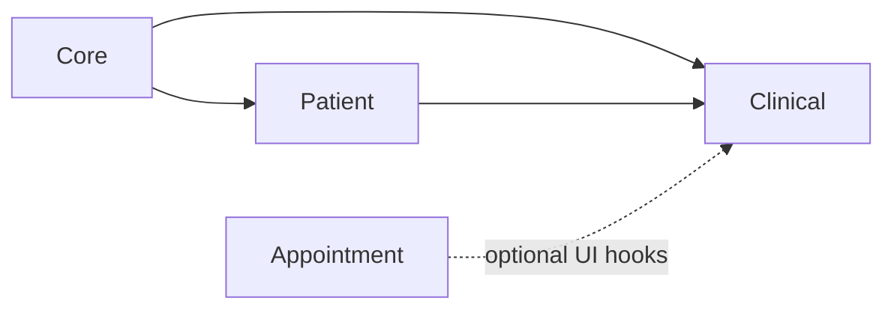

# Clinical module

**In one sentence:** The Clinical module is where **care happens on the record**—visits (**encounters**), **vital signs**, **clinical notes**, **orders** (**service requests** and their line items), **tasks** that staff fulfill, and **allergies**—so the hospital has a structured story of what was done for the patient and when.

## Why this module exists

Registration (Patient) tells you **who** someone is. Clinical tells you **what happened to them medically**: they arrived for a visit, someone measured their blood pressure, a doctor wrote a note, a lab was ordered, a nurse completed a task. Without this layer, you only have demographics, not a **medical dossier** or a **timeline of care**.

## Where Clinical fits in FlowRise

- **Depends on Core** (branches, locations, departments, users) and **Patient** (every clinical fact ties to a patient).
- **Appointment** can integrate with the same **clinical workspace** screens (for example, booking actions from patient-oriented pages when that module is enabled).

## What you can do with it (everyday language)

- **Start and manage encounters** (outpatient, inpatient, emergency, virtual—whatever your configuration supports).
- **Record vital signs** (blood pressure, pulse, temperature, and related measurements).
- **Write clinical notes** tied to the patient’s care.
- **Place service requests** (orders such as lab, imaging, or other services your catalog defines) and track **request items**.
- **Track tasks** so departments know what must be done and whether it is done.
- **Record allergies** where that workflow is enabled.
- Use **workspace** pages (patient list, timeline, profile) to work in a patient-centric way rather than only from generic admin lists.

Some refinements (for example, automatically hiding unrelated patients when you are already “inside” one patient’s context) may still be **in progress**—see [Module status](../../docs/shared/module-status.md) and the implementation plan below.

## How it works (simple)

1. A clinician or clerk opens a **patient** in the clinical area of the admin app.
2. They create or update an **encounter**, then add **vitals**, **notes**, or **orders** as the visit unfolds.
3. Business rules live in **service classes** under `app/Classes/Services/` (not only inside database models), so the same rules apply no matter which screen triggered the change.
4. Data is stored in clinical tables; other modules or reports read it through models and services—**not** by bypassing those layers.

## What is inside this folder (high level)

| Path | Purpose |
|------|---------|
| `app/Models/` | Encounters, vitals, notes, service requests, request items, tasks, allergies, participants, etc. |
| `app/Classes/Services/` | Create, update, search, and filter operations—**primary business logic**. |
| `app/Filament/` | Plugin registration, workspace pages, widgets, and clinical UI clusters. |
| `app/Schemas/` | Shared form schema pieces where used. |
| `app/Policies/` | Who may view or edit sensitive clinical rows. |
| `database/migrations/` | Schema for clinical tables. |

## Dependencies

- **Core** and **Patient** (see `module.json`).

## Further reading

- **Implementation plan:** [docs/implementation-plan.md](docs/implementation-plan.md)
- **Staff-facing workflows:** [Clinical workflows](../../docs/user-guide/clinical-workflows.md)

## For developers

- **Namespace:** `Modules\Clinical\...`
- **Service provider:** `Modules\Clinical\Providers\ClinicalServiceProvider` (registers sub-providers and loads Filament views under the `clinical` view namespace).
- **Patterns:** prefer `*Service` classes for writes; use Filament `Schema` / action patterns consistent with the rest of FlowRise (see implementation plan for naming).
- **FHIR:** data shapes and names often follow **HL7 FHIR** ideas (for example, “Encounter”, “ServiceRequest”) to ease interoperability—you can ignore FHIR day-to-day unless you are building an export or API.
