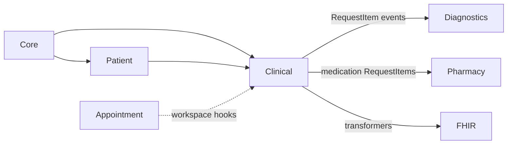

# Clinical module

**In one sentence:** The Clinical module is where **care happens on the record**—visits (**encounters**), **diagnoses**, **vital signs**, **clinical notes**, **orders** (**service requests** and their line items), **tasks** that staff fulfill, **allergies**, **medication administration (MAR)**, and **nursing care plans**—so the hospital has a structured story of what was done for the patient and when.

## Why this module exists

Registration (Patient) tells you **who** someone is. Clinical tells you **what happened to them medically**: they arrived for a visit, someone measured their blood pressure, a doctor wrote a note and diagnosis, a lab was ordered, a nurse completed a task or care-plan intervention. Without this layer, you only have demographics, not a **medical dossier** or a **timeline of care**.

## Where Clinical fits in FlowRise

- **Depends on Core** (branches, wards/beds, departments, users, settings) and **Patient** (every clinical fact ties to a patient).
- **Appointment** injects "Add appointment" / "Schedule appointment" header actions into the workspace pages and auto-books a follow-up on discharge.
- **Diagnostics** listens for diagnostic `RequestItem` create/cancel events and creates or cancels `DiagnosticFulfillment` records, and contributes the Pending Diagnostics / Completed Results widgets to the workspace.
- **Pharmacy** attaches `dispenses` to medication-related `RequestItem` records and provides the prescription schedule calculator used by MAR.
- **Billing** contributes the encounter invoices relation manager and the patient billing summary widget, and finalises charges when an encounter completes or a patient is discharged.
- **Insurance** supplies NHIS coverage fields and the OTAC claim-check-code gateway used on encounters.
- **MCH** reuses the patient header actions and creates antenatal / postnatal / child-welfare encounters.
- **FHIR module** exposes Encounter, Condition, AllergyIntolerance, CarePlan, and Goal read/search using Clinical transformers.

```mermaid
flowchart LR
  Core[Core]
  Patient[Patient]
  Clinical[Clinical]
  Appointment[Appointment]
  Diagnostics[Diagnostics]
  Pharmacy[Pharmacy]
  FHIR[FHIR]
  Core --> Patient
  Core --> Clinical
  Patient --> Clinical
  Appointment -.->|workspace hooks| Clinical
  Clinical -->|RequestItem events| Diagnostics
  Clinical -->|medication RequestItems| Pharmacy
  Clinical -->|transformers| FHIR
```

## What you can do with it (everyday language)

- **Start and manage encounters** (outpatient, inpatient, emergency, virtual, home visit, antenatal, postnatal, child welfare) with coverage type and NHIS claim check code, triage priority, completion and cancellation.
- **Record encounter diagnoses** with ICD-10/ICD-11 coding helpers (including autocode / claim-check support where configured).
- **Record vital signs** (blood pressure, pulse, temperature, and related measurements).
- **Write clinical notes** tied to the patient’s care.
- **Place service requests** (orders such as lab, imaging, or other services your catalog defines) and track **request items**.
- **Track tasks** so departments know what must be done and whether it is done.
- **Record allergies** where that workflow is enabled.
- **Administer medications (MAR)** via the medication administration board, dose reminders, workspace actions, and patient relation manager.
- **Build nursing care plans** (problems, strengths, objectives, interventions, evaluations, routine care, nursing diagnosis catalogue) with workspace entry points and PDF export.
- Run the **inpatient lifecycle (ADT)**: admission requests that ward staff accept or reject (with bed reservation and 24-hour expiry), internal transfers, transfers out, passes, expected discharge dates, discharge with readiness checks, and **discharge summaries** (draft, sign, amend, print).
- Work from the **Ward Board** (beds, occupants, incoming requests, nurse assignment, bed status) and the **Clinical Workspace** (role-based tabs), plus the **Timeline**, **Patient Profile** and **Medication Canvas** pages.
- Browse ICD-11 codes in the **ICD Browser** (WHO ICD API).

For laboratory, radiology, and pathology fulfillment after an order is placed, see [Diagnostics Workflows](../../docs/user-guide/diagnostics.md).

## How it works (simple)

1. A clinician or clerk opens a **patient** in the clinical area of the admin app.
2. They create or update an **encounter**, then add **vitals**, **notes**, **diagnoses**, **orders**, or a **care plan** as the visit unfolds.
3. Business rules live in **service classes** under `app/Classes/Services/` (not only inside database models), so the same rules apply no matter which screen triggered the change.
4. Data is stored in clinical tables; other modules or reports read it through models and services—**not** by bypassing those layers.

## What is inside this folder (high level)

| Path | Purpose |
|------|---------|
| `app/Models/` | 26 models: Encounter, EncounterParticipant, EncounterLocationEvent, AdmissionRequest, DischargeSummary, EncounterDiagnosis, DiagnosisCode, VitalSign, ClinicalNote, Allergy, ServiceRequest, RequestItem, Task, MedicationAdministration, MedicationDoseReminderLog, CanvasLayout, CarePlan (+ Problem, ProblemStrength, Objective, Intervention, Evaluation, RoutineCare, Diagnosis, Order), NursingDiagnosisCatalogue. |
| `app/Classes/Services/` | 34 services: Encounter, Adt, BedAssignment, WardBoard, DischargeReadiness, DischargeSummary, VitalSign, ClinicalNote, Diagnosis / DiagnosisCode / IcdCatalogue / DiagnosisSearch, Allergy, ServiceRequest, Task, Fulfillment, MedicationAdministration / DoseSchedule / FulfillmentPolicy / SlotStatusResolver / Canvas, CarePlan (+ Problem / Objective / Order), NursingDiagnosis, NhisClaimCodeGateway, Pdf, ... |
| `app/Classes/Actions/` | `PatientActions` (shared header/More Actions menu reused by Patient, MCH and workspace pages), `EncounterActions` (ADT and lifecycle actions), `DischargeSummaryActions`. |
| `app/Classes/Fhir/` | FHIR transformers (Encounter, Condition, AllergyIntolerance, CarePlan, Goal). |
| `app/Filament/` | `ClinicalPlugin`; **Workspace** cluster (Clinical Workspace, Ward Board, Timeline, Patient Profile, Medication Canvas, legacy Patient Workspace) and the top-level **Care Plans** page, both in the Workspaces sidebar group; **Clinical** cluster (Patient Care group) with 8 resources (Encounters, Service Requests, Tasks, Clinical Notes, Vital Signs, and the menu-hidden Care Plans, Allergies, Encounter Diagnoses) and pages MAR Board, ICD Browser, Clinical settings; relation managers for the patient record; ~20 widgets; `Filament/Schemas/EncounterCoverageSchema`, `Filament/Support/MarRecordDoseFormSchema`. |
| `app/Policies/` | Allergy, CarePlan, ClinicalNote, DischargeSummary, EncounterDiagnosis, Encounter, ServiceRequest, Task, VitalSign. |
| `app/Events/`, `app/Listeners/`, `app/Notifications/` | Admission requested/accepted/rejected/cancelled, patient admitted/transferred/discharged, encounter finished/cancelled, request item created/updated/cancelled; ward and patient notifications (patient-facing channels per Core notification settings; ward-staff channels per the Clinical settings "Staff alert channels"; MAR reminders per "Reminder channels"). |
| `app/Console/` | `clinical:mar-dose-reminders` (every 5 min), `clinical:expire-admission-requests` (hourly), `clinical:backfill-bed-status`. |
| `app/Http/` | `CarePlanPdfController` (`GET /care-plans/{carePlan}/pdf`), `DischargeSummaryPdfController` (`GET /discharge-summaries/{dischargeSummary}/pdf`). |
| `database/migrations/` | 42 migrations as of 2026-09-20; 26 factories; seeders for diagnosis codes and the nursing diagnosis catalogue. |

## Current status

**Complete** for operational clinical workflows (including MAR, ADT with admission requests and discharge summaries, diagnoses, and care plans). See [Module Status](../../docs/shared/module-status.md).

Configuration lives in `config/config.php` (admission request expiry 24 h, long-stay threshold 7 days, bed cleaning on discharge, bed reservation on request, ward notification roles, discharge readiness rules and blocking levels, MAR payment/schedule/reminder defaults, WHO ICD-11 API credentials) and on the Clinical settings page (of which only the MAR "require payment before", "emergency exemption" and "reminders enabled" toggles are read at runtime).

## Dependencies

- **Core** and **Patient** (see `module.json`).

## Further reading

- **Implementation record:** [docs/implementation-plan.md](docs/implementation-plan.md)
- **ADT and bed management internals:** [docs/developer-guide/adt-bed-management.md](../../docs/developer-guide/adt-bed-management.md)
- **Staff-facing workflows:** [Clinical workflows](../../docs/user-guide/clinical-workflows.md)

## For developers

- **Namespace:** `Modules\Clinical\...`
- **Service provider:** `Modules\Clinical\Providers\ClinicalServiceProvider` (registers sub-providers and loads Filament views under the `clinical` view namespace).
- **Patterns:** prefer `*Service` classes for writes; use Filament `Schema` / action patterns consistent with the rest of FlowRise (see implementation plan for naming).
- **Custom permissions:** `manage_clinical_settings`, `manage_bed_status`, `sign_discharge_summary`, `print_discharge_summary` (config), plus `discharge_patient` / `print_hospital_card` from Patient and `administer_medication` / `order_prescription_medication` from Pharmacy.
- **Tests:** `php artisan test --compact Modules/Clinical/tests` (93 test files; the four Playwright browser tests time out on machines without a working headless Chromium and are not a regression signal).
- **FHIR:** data shapes and names often follow **HL7 FHIR** ideas (for example, “Encounter”, “ServiceRequest”, “CarePlan”) to ease interoperability—you can ignore FHIR day-to-day unless you are building an export or API.
