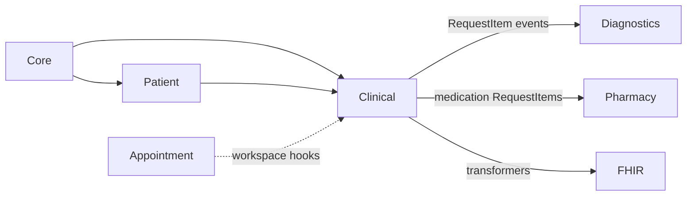

# Clinical module

**In one sentence:** The Clinical module is where **care happens on the record**—visits (**encounters**), **diagnoses**, **vital signs**, **clinical notes**, **orders** (**service requests** and their line items), **tasks** that staff fulfill, **allergies**, **medication administration (MAR)**, and **nursing care plans**—so the hospital has a structured story of what was done for the patient and when.

## Why this module exists

Registration (Patient) tells you **who** someone is. Clinical tells you **what happened to them medically**: they arrived for a visit, someone measured their blood pressure, a doctor wrote a note and diagnosis, a lab was ordered, a nurse completed a task or care-plan intervention. Without this layer, you only have demographics, not a **medical dossier** or a **timeline of care**.

## Where Clinical fits in FlowRise

- **Depends on Core** (branches, locations, departments, users) and **Patient** (every clinical fact ties to a patient).
- **Appointment** integrates with the same **clinical workspace** screens (for example, booking actions from patient-oriented pages).
- **Diagnostics** listens for diagnostic `RequestItem` create/cancel events and creates or cancels `DiagnosticFulfillment` records.
- **Pharmacy** attaches `dispenses` to medication-related `RequestItem` records.
- **FHIR module** exposes Encounter, Condition, AllergyIntolerance, CarePlan, and Goal read/search using Clinical transformers.

```mermaid
flowchart LR
  Core[Core]
  Patient[Patient]
  Clinical[Clinical]
  Appointment[Appointment]
  Diagnostics[Diagnostics]
  Pharmacy[Pharmacy]
  FHIR[FHIR]
  Core --> Patient
  Core --> Clinical
  Patient --> Clinical
  Appointment -.->|workspace hooks| Clinical
  Clinical -->|RequestItem events| Diagnostics
  Clinical -->|medication RequestItems| Pharmacy
  Clinical -->|transformers| FHIR
```

## What you can do with it (everyday language)

- **Start and manage encounters** (outpatient, inpatient, emergency, virtual—whatever your configuration supports).
- **Record encounter diagnoses** with ICD-10/ICD-11 coding helpers (including autocode / claim-check support where configured).
- **Record vital signs** (blood pressure, pulse, temperature, and related measurements).
- **Write clinical notes** tied to the patient’s care.
- **Place service requests** (orders such as lab, imaging, or other services your catalog defines) and track **request items**.
- **Track tasks** so departments know what must be done and whether it is done.
- **Record allergies** where that workflow is enabled.
- **Administer medications (MAR)** via the medication administration board, dose reminders, workspace actions, and patient relation manager.
- **Build nursing care plans** (problems, strengths, objectives, interventions, evaluations, routine care, nursing diagnosis catalogue) with workspace entry points and PDF export.
- Track **ADT location events** (admit/transfer/discharge bed moves) on encounters.
- Use **workspace** pages (patient list, timeline, profile) to work in a patient-centric way rather than only from generic admin lists.

For laboratory, radiology, and pathology fulfillment after an order is placed, see [Diagnostics Workflows](../../docs/user-guide/diagnostics.md).

## How it works (simple)

1. A clinician or clerk opens a **patient** in the clinical area of the admin app.
2. They create or update an **encounter**, then add **vitals**, **notes**, **diagnoses**, **orders**, or a **care plan** as the visit unfolds.
3. Business rules live in **service classes** under `app/Classes/Services/` (not only inside database models), so the same rules apply no matter which screen triggered the change.
4. Data is stored in clinical tables; other modules or reports read it through models and services—**not** by bypassing those layers.

## What is inside this folder (high level)

| Path | Purpose |
|------|---------|
| `app/Models/` | Encounters, diagnoses, vitals, notes, service requests, request items, tasks, allergies, care plans (+ child entities), MAR, participants, etc. |
| `app/Classes/Services/` | Create, update, search, and filter operations—**primary business logic**. |
| `app/Classes/Fhir/` | FHIR transformers (Encounter, Condition, AllergyIntolerance, CarePlan, Goal). |
| `app/Filament/` | Plugin registration, workspace pages, widgets, and clinical UI clusters (8 resources including Care Plans and Encounter Diagnoses). |
| `app/Schemas/` | Shared form schema pieces where used. |
| `app/Policies/` | Who may view or edit sensitive clinical rows. |
| `database/migrations/` | Schema for clinical tables (35 migrations as of 2026-08-04). |

## Current status

**Complete** for operational clinical workflows (including MAR, ADT, diagnoses, and care plans). See [Module Status](../../docs/shared/module-status.md).

## Dependencies

- **Core** and **Patient** (see `module.json`).

## Further reading

- **Implementation plan:** [docs/implementation-plan.md](docs/implementation-plan.md)
- **Staff-facing workflows:** [Clinical workflows](../../docs/user-guide/clinical-workflows.md)

## For developers

- **Namespace:** `Modules\Clinical\...`
- **Service provider:** `Modules\Clinical\Providers\ClinicalServiceProvider` (registers sub-providers and loads Filament views under the `clinical` view namespace).
- **Patterns:** prefer `*Service` classes for writes; use Filament `Schema` / action patterns consistent with the rest of FlowRise (see implementation plan for naming).
- **FHIR:** data shapes and names often follow **HL7 FHIR** ideas (for example, “Encounter”, “ServiceRequest”, “CarePlan”) to ease interoperability—you can ignore FHIR day-to-day unless you are building an export or API.
